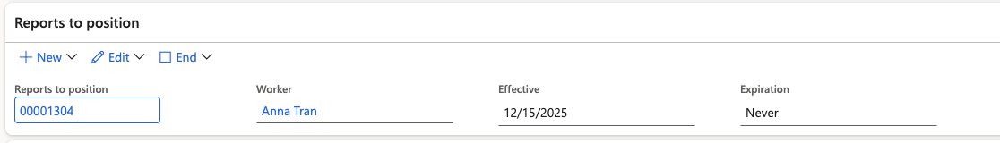
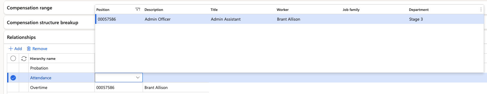

# Assign attendance and overtime managers to a position

An employee's attendance and overtime are visible to, and approved by, whoever sits above them in the attendance and overtime hierarchies. You set that on the employee's position. Until you do, only the line manager sees them.

1. Open the employee

   In D365, go to **Human Resources ▸ Positions ▸ All positions** and open the employee whose approver you are setting.

2. Open their position

   Open the employee record and open the **Reports to position** tab. You will see the line manager already recorded.

   

3. Add the attendance and overtime hierarchy

   Open the **Relationships** tab. Click **+ Add** to assign the person or position that will approve the employee's attendance and overtime. This is often the same person as the attendance approver, but it doesn't have to be.

   

5. Save

   Click **Save**. The employee now appears under that approver when they switch to the hierarchy view in the attendance details and overtime details forms in D365, and under **Hierarchy** on the team attendance screens in ESS.

Where the line manager is also the attendance and overtime approver, you can leave these unset — the employee will appear under the line view instead. An employee who is in neither your line nor your hierarchy does not appear for you at all, by design.
