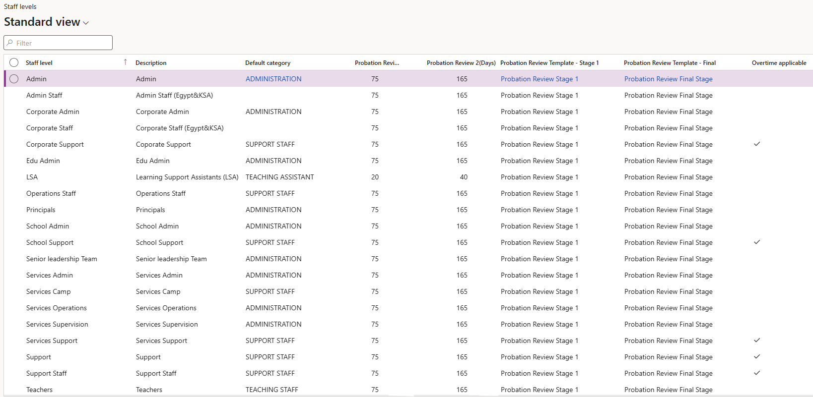
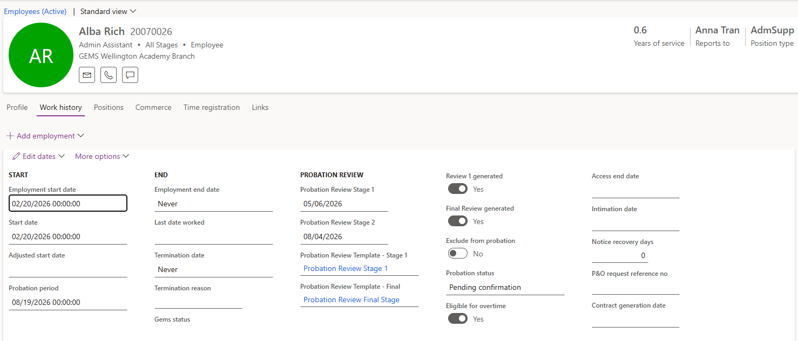

# Set overtime eligibility on staff levels

Overtime eligibility is decided by staff level, not person by person. You flag the categories that can claim overtime once, and every hire into a position in one of those categories picks the flag up automatically as their worker action completes.

1. Open the staff levels form

   In D365, open the **Staff levels** form and find the staff position category and staff category you are setting — for example, transport support and support staff.

2. Tick the overtime flag

   Set **Overtime applicable** against that category.

   

   Only staff in categories flagged here are treated as eligible for overtime. Categories left unflagged produce no overtime records, however many extra minutes their attendance logs show.

3. Save

   Click **Save**. The setting takes effect for worker actions completed from now on — it does not retrospectively update people already hired.

4. Complete the hire worker action as usual

   Hire the employee through the normal worker action process, with a position whose staff position category and staff level match the one you flagged. Submit the action to workflow and let it be approved.

   The worker action has to complete, not just be submitted. The flag is written to the employment record as part of the action's processing, so it is not there while the workflow is still running.

5. Check the flag on the employee

   Once the employee record has been created, open it and go to the **Employment history** area. **Eligible for overtime** is set to **Yes**.

   

6. Amend the flag where it doesn't fit

   Click **Edit** and change the flag on the individual employee where the staff level rule isn't right for them, then **Save**. The staff level sets the default; the employee record is where an exception is recorded.
