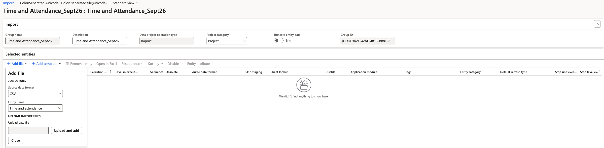
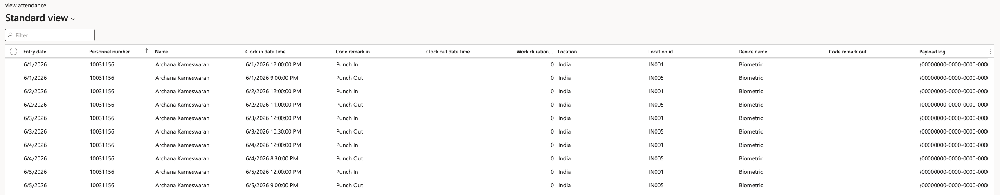

# Import attendance data

Attendance data reaches D365 as punch records — a clock-in and a clock-out per employee per day. An integration with the biometric system delivers these automatically, so you won't run this import daily or weekly. Use it when the integration isn't in place yet, or to correct or add records in bulk.

The Excel or CSV import below is how the data gets in.

1. Open a data import project

   In D365, go to **System administration ▸ Workspaces ▸ Data management** and click **Import**.

2. Name the project

   Give the project a **Group name**. If you are duplicating an existing project, give it a different name so you don't overwrite the original.

3. Select the entity and file type

   Set the file type to **CSV** and select the **Time and attendance** entity.

   

4. Upload the file

   Click **Upload** and select your file, then apply it to the project.

5. Map the remaining columns

   You may see a warning that the entity is not fully mapped. Map any outstanding fields — the code remark, the timestamp, the device ID and the device location — then apply the mapping.

6. Run the import

   Click **Import now**. The file loads into the attendance log table.

7. Check the loaded records

   Go to **Time and attendance ▸ Inquiries and reports ▸ Attendance ▸ Attendance log** and review what came in. Each row holds the entry date, employee ID, clock-in date and time, code remark in, any remark passed through from the time and attendance clock, the clock-out date and time, and the location and device it was recorded on.

   

   Work duration is not calculated at this point. The attendance log is only the raw record of a punch-in and punch-out—durations, regular minutes, and overtime are calculated by the summary batch job.

   To run the summary, see [Run the attendance summary batch job](./06-run-the-attendance-summary-batch-job.md).
