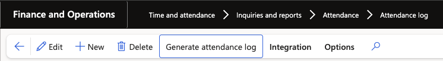
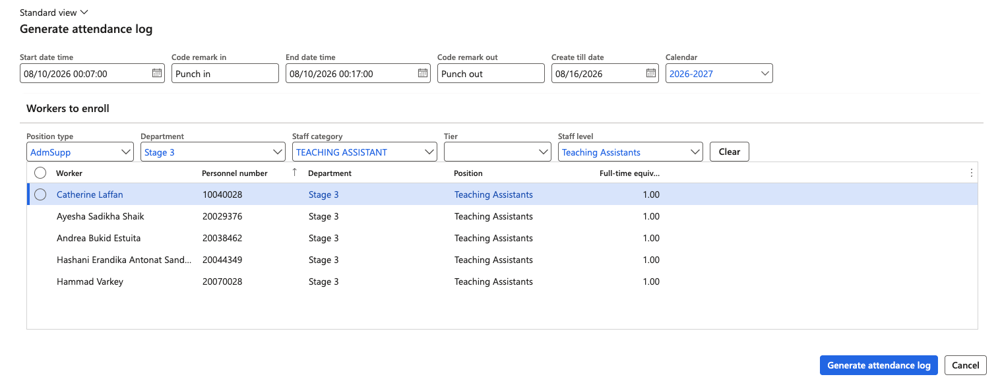

# Generate attendance logs

Where you need attendance logs for employees who have no punch data — because they are not on the biometric system, or because a period needs backfilling — you can have D365 generate them from a default start and end time and a working time calendar. It creates one punch in and one punch out per applicable working day in the range.

1. Open the attendance logs form

   In D365, go to **Time and attendance ▸ Attendance logs**.

2. Open the generation form

   Click **Generate attendance logs**.

   

3. Set the punch in details

   Enter the **Start date and time** — the date the range begins and the time to use as the punch in, for example 10 August at 08:00 — and set the **Code remark** to **Punch in**.

4. Set the punch out details

   Enter the **End date and time** using the punch out time, for example 17:00, and set its **Code remark** to **Punch out**. The start and end date and time define the punch in and punch out times used on every generated record.

5. Set the generate to date

   Enter the **Create to date** — for example 14 August. This is how far forward the records are generated.

6. Select the working time calendar

   Choose the working time calendar to apply. It determines which days in the range count as working days, so non-working days produce no records.

7. Select the workers

   Under the workers area, narrow to the employees you want. The available criteria are position, tier, department, staff category and staff level, or you can pick named employees from the list.

8. Generate

   Click **Generate attendance logs**. A notification confirms how many employees were processed.

9. Check the generated records

   Refresh the attendance logs form and filter to the personnel numbers and the entry dates you generated for. You should see a punch in and a punch out for each applicable working day in the range, with the code remarks you set.

   

The process is safe to re-run over the same period. Re-running with the same parameters does not create duplicates — existing records are left unchanged, and only records that are missing, for example a day someone has deleted, are generated again.

Generated records feed the normal process from here. Run the attendance summary batch job over them as you would over imported punch data — see [Run the attendance summary batch job](./06-run-the-attendance-summary-batch-job.md).
