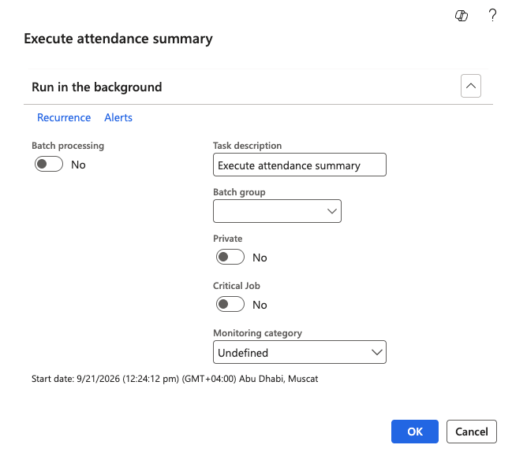

# Run the attendance summary batch job

Attendance logs contain only raw punch records. The **Execute attendance summary** job reads them and creates the summary record for each employee and day—their work duration, regular minutes, and overtime minutes—which every other attendance screen and the ESS portal read from.

In normal operation, this runs as a recurring batch process right after the data feed, so nobody runs it by hand. Run it manually when you have just imported, generated or adjusted attendance logs and want the results now.

1. Open the job

   In D365, go to **Time and attendance ▸ Periodic tasks ▸ Execute attendance summary**. You can also search for **Execute attendance summary** in the search bar.

2. Run it

   Click **OK**.

   

3. Wait for the message centre to confirm

   The message centre tells you when the run is complete.

4. Check the results

   Go to **Time and attendance ▸ Inquiries and reports ▸ Attendance ▸ Attendance detail** and find an employee in the batch. Each day's record shows the clock-in and clock-out times, work duration, regular minutes, and any overtime minutes.

   For example, an employee who clocked in at 08:00 and out at 17:05 shows a work duration of 545 minutes, 480 regular minutes, and 65 minutes of overtime. Their location, location ID and device name carry through from the imported log.

Run this job again any time you change an attendance log. Editing the log on its own changes nothing downstream — see [Adjust an attendance record](./08-adjust-an-attendance-record.md).
