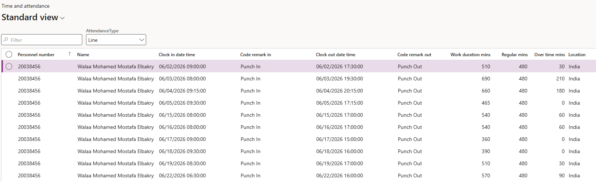
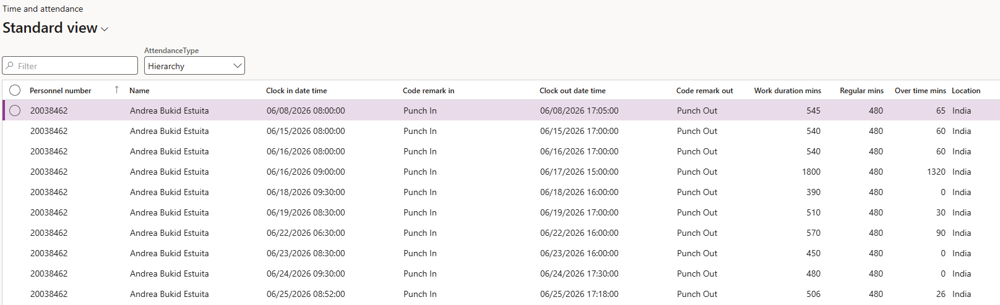

# Review attendance details

The attendance details form is the summarised view of who worked what, one record per employee per day. It is built from the attendance logs by the summary batch job, so anything you see here reflects the last time that job ran.

1. Open the attendance details form

   In D365, go to **Time and attendance ▸ Attendance details**.

2. Read a record

   Each row shows the date, the clock in and clock out times, the work duration in minutes, the regular minutes, the overtime minutes, and the location, location ID and device name the punch came from.

   

3. Switch between the line and hierarchy views

   The form shows you the employees who report to you, and there are two ways of reporting. **Line** shows your direct reports. **Hierarchy** shows the people who report to you for attendance through the attendance hierarchy on their position.

   These are usually different sets of people, and that is the point of the two views — a designated attendance manager sees their attendance reports under Hierarchy even though those people report to somebody else on the line.

4. Search for a specific employee

   Filter on the **Name** column to find one person. If the employee doesn't appear, they are not in your line or your attendance hierarchy — that is a deliberate restriction, not a data problem.

5. View one employee's own record

   To look at a single employee's attendance from their record instead, go to **Human Resources ▸ Employees**, open the employee, and under the **Work** tab go to **Attendance ▸ View attendance**.

   

   This shows all of their attendance and overtime information — work duration, regular minutes and overtime minutes — in one place, and is the view an employee sees for themselves.
