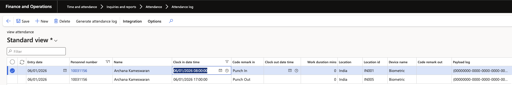

# Adjust an attendance record

When an employee's recorded times are wrong—the biometric machine wasn't working, or they raised an HR request for a late arrival or early exit—you correct the attendance log and re-run the summary. Use this route for a one-off correction; for bulk corrections, load them through the import instead.

1. Open the attendance logs

   In D365, go to **Time and attendance ▸ Inquiries and reports ▸ Attendance ▸ Attendance log**.

2. Find the record

   Filter to the employee and the date you are correcting. Apply the filter before you edit so you don't accidentally change anyone else's record.

3. Edit the times

   Click **Edit** and change the **Clock in date time** to the correct values. Make sure the **Code remark in** column matches the correct action.

   

4. Save

   Click **Save**.

5. Re-run the summary batch job

   Go to **Time and attendance ▸ Periodic tasks ▸ Execute attendance summary** and click **OK**. Wait for the message centre to confirm completion.

   This step is not optional. The attendance log is the raw record; this job calculates the work duration, regular minutes, and overtime everyone uses. Until it runs again, your correction exists only in the log.

6. Check the corrected record in D365

   Go back to **Time and attendance ▸ Attendance details**, or to **Employees ▸ Work ▸ Attendance ▸ View attendance** on the employee, and confirm the corrected times and the recalculated duration.

7. Check it in ESS

   Open the employee's attendance in ESS and check the same date. ESS refreshes with a five-minute delay rather than instantly, so allow a moment before deciding the change hasn't taken effect.

   The interval is deliberate—the attendance feed arrives once a day, so refreshing the portal221 every minute would cost performance for no gain.
