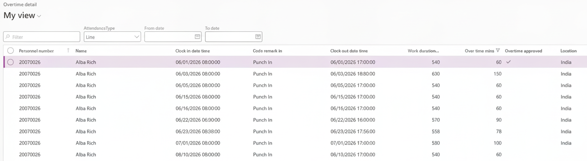

# Review and approve overtime

Overtime details is the manager's view of overtime in D365, and the first of the three approval stages. It is the same approval the manager can do from ESS — whichever route is used, the record is the same one.

1. Open the overtime details form

   In D365, go to **Time and attendance ▸ Overtime details**.

   

2. Understand what you are seeing

   Only employees with overtime records appear here. The form has a filter applied to the overtime minutes column that excludes everyone with none, so it is a working list rather than a full roster.

   Overtime below the threshold set in the human resource shared parameters is excluded too — see [Configure time and attendance parameters](./01-configure-time-and-attendance-parameters.md).

3. Narrow to a date range

   Set a **From date** and **To date** and click **Get data** to see overtime between those dates.

4. Switch between the line and hierarchy views

   As with attendance details, **Line** shows your direct reports and **Hierarchy** shows the people assigned to you through the overtime hierarchy on their position.

5. Check who last changed the record

   The **Modified by** and **Modified date and time** columns show who last touched each overtime record, so you can see whether an entry has been amended and by whom before you approve it.

6. Approve

   Click **Edit**, then select the records you want to approve. You can select one record, or several for the same employee, and approve them together.

   Click **Approve**. The **Total approved minutes** updates as the records are approved.

Approving here is the manager stage. The record then has to pass HR and finance before it reaches payroll — see [Complete the HR and finance overtime approvals](./10-complete-the-hr-and-finance-overtime-approvals.md).

An overtime record approved by the manager in ESS shows as approved here as soon as it is done — the two screens are the same data, not a copy. See *Approve your team's overtime* in the ESS guide.
