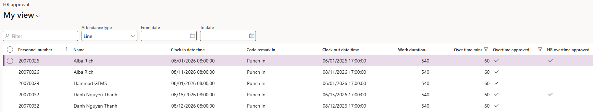
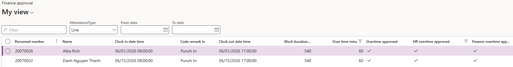

# Complete the HR and finance overtime approvals

Three people approve overtime in sequence: the manager first, then HR, then finance. Each stage sees only what the previous stage approved, so the list gets shorter as it moves along.

1. Open the HR approval form

   In D365, go to the **HR approval** form. **Time and attendance ▸ Inquiries and reports ▸ Attendance ▸ HR approval**.

2. Review what has reached you

   Only the records the manager has already approved appear here. If a manager approved three records, you'll see the same three— everything else they left is not on your list.

   

   The **Last modified by** and date and time columns show who approved the record before you and when.

4. Approve as HR

   Select the records HR is approving and approve them. You do not have to approve everything that reaches you — approving two of three records sends only those two on.

5. Save

   Click **Save**.

6. Open the finance approval form

   Go to the **Finance approval** form. **Time and attendance ▸ Inquiries and reports ▸ Attendance ▸ Finance approval**.

7. Approve as finance

   The records HR approved are the ones listed here. Review the date, time, and punch location for each, then approve.

   

Overtime that has cleared all three stages is what gets sent out for payroll processing. At the time this was recorded, the payroll integration was still being built with the Phoenix team, so check with your system administrator what the current hand-off to payroll is.
