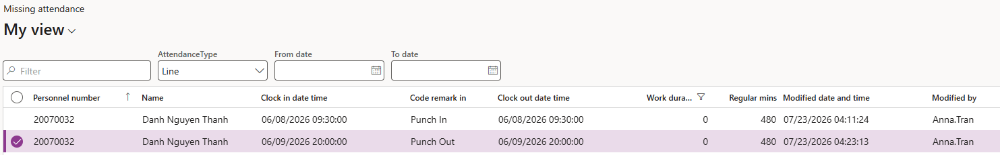

# Review missing attendance

An employee who punches in in the morning but never punches out in the evening leaves an incomplete day. The missing attendance form collects these so they can be chased and corrected rather than quietly producing a wrong duration.

1. Open the missing attendance form

   In D365, go to the **Missing attendance** form under time and attendance.

2. Read the exceptions

   Each row is a day where one half of the pair is absent — a punch in on a date with no punch out, or a punch out on a date with no punch in. Both cases are recorded as missing attendance.

   

3. Switch between the line and hierarchy views

   As on the other attendance forms, **Line** shows your direct reports and **Hierarchy** shows the people assigned to you through the attendance hierarchy.

4. Correct the record

   Where you have established what the missing time should have been — from the employee, their manager, or an HR request for a late arrival or early exit — correct it in the attendance logs and re-run the summary batch job. See [Adjust an attendance record](./08-adjust-an-attendance-record.md).
