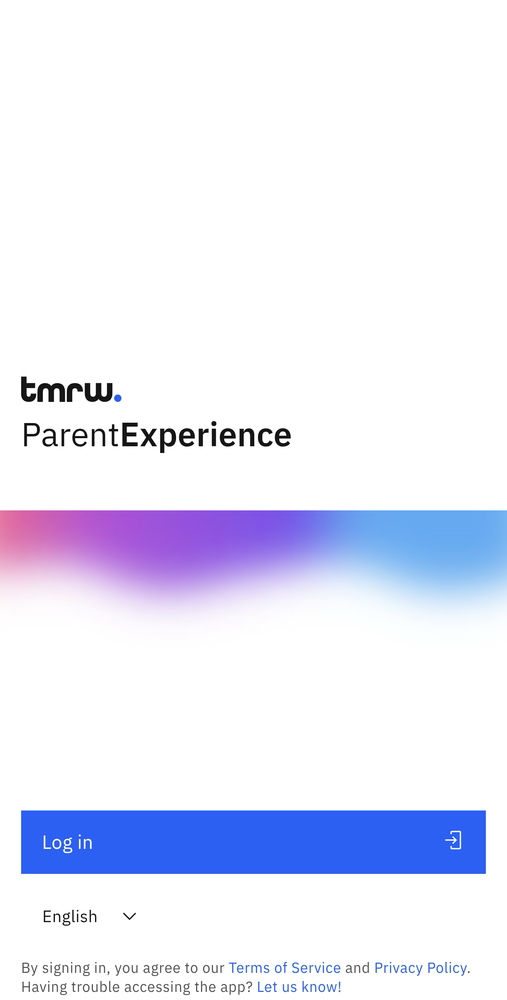

# Sign in to Parent Experience Place (PxP)

The ParentExperience Place (PxP) app uses the same email you use for GEMS communications.

1. Sign in with email

   Open the ParentExperience (PxP) app and click **Log in**.

   
   
2. Enter your details

   Enter the email and password you use for all GEMS communications, then click **Sign in**.

   > **Note:** After signing in, a pop-up will ask if you wish to enable fingerprint sign-in.
