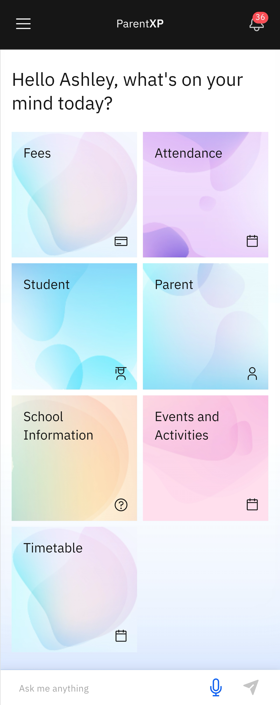

# Find Your Way Around

1. Home screen and Subject tiles

   After signing in, the home screen will appear. Here you will see the **Navigation bar** and the Action **Tiles**. Click a tile to perform a related task. 

   

2. Use the Navigation Bar

   The **navigation bar** runs across the top of the app at all times. There is a hamburger menu (≡) on the left; here you can view **Notifications**, **Topics**, **Settings** and **GEMS Rewards**. You can change the app's theme to dark or light mode, or both. At the bottom of the hamburger menu is the log out icon. On the right of the **Navigation bar** is a **Notifications** bell icon.
   
   

3. Asking Nova Questions

   Nova is the intelligent chat agent that will help you complete different tasks in the PxP app. The Nova chat runs across the base of the app on any screen. Click on the **Ask me anything** space to type, or click the **microphone icon** to ask about a task. Click the arrow icon to receive the instructions or support.

   

