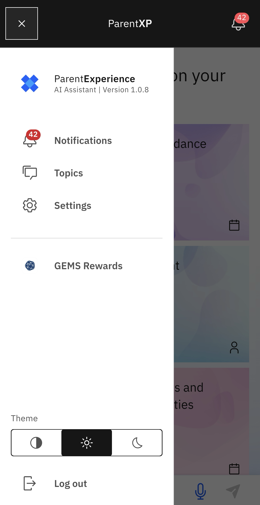

# Log out of Parent Experience Place (PXP)

1. Open the hamburger menu

   At the top left of any screen in the app on the navigation bar, tap the hamburger menu (≡).
   
3. Click Log out

   At the bottom of the menu, you will find the **Log out** button. Click it.

   

   > **Note:** A pop-up will appear asking you to confirm that you want to log out.
