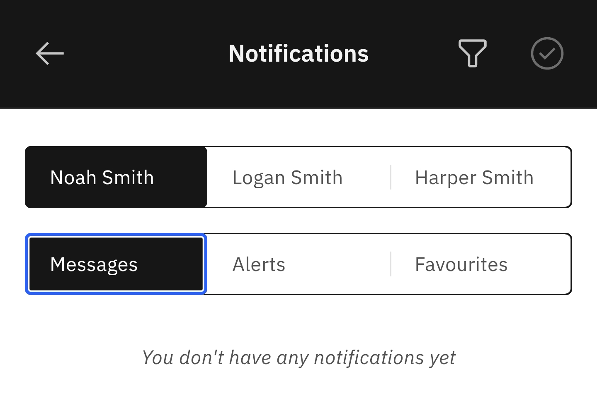

# Check Notifications

1. Click on the Notifications Bell icon

   On the right side of the **navigation bar**, tap the bell icon.

2. Select your child's name

   In cases where more than one child is enrolled in the school, you can choose which notifications you view. Each child's name appears across the top of the screen.

3. Choose between Messages, Alerts or Favourites

   You can select the **Messages**, **Alerts**, or **Favourites** tabs to view. Click the filter icon in the **navigation bar** to filter Notifications, as **All**, **Unread**, or **Read**. On the right, a circled checkmark lets you mark all notifications as read.

   
