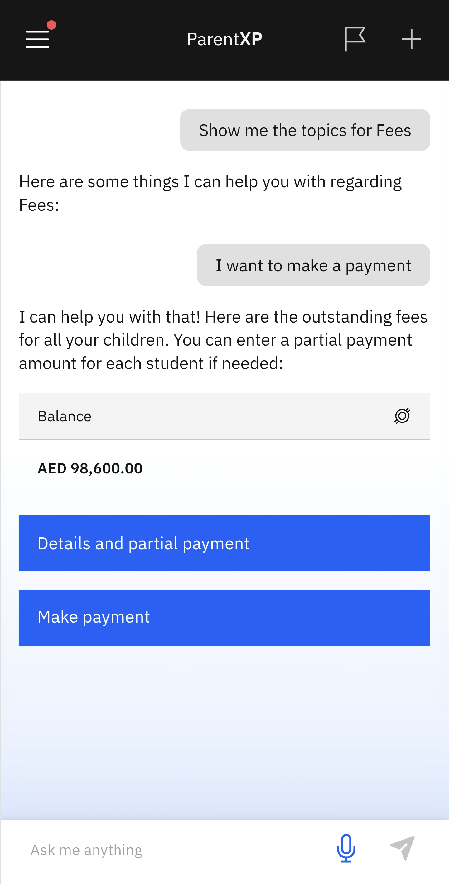

# Pay Outstanding Fees

1. Click the Fees tile on the home screen

   Select the **Fees** tile. Nova will provide a selection of prompts to choose from. Select the **Pay Outstanding Fees** prompt on the screen.

2. Choose your child from the dropdown menu

   Where there are more than one child enrolled in the school, you can choose the child you would like to make payment for. The payments are listed below each child. Toggle between each child to get the total amount due.

3. Select the outstanding payment

   You can select more than one payment to make, you can also make payment for all your children. Select all the payments you wish to cover.

4. Make payment

   You can view the details of each payment by selecting **Details and partial payment** or tap **Make payment**. The payment summary will appear where you have the option to either **Edit amounts** or **Proceed to payment**. Where the app will connect to the school's finance system to complete the payment.

   
