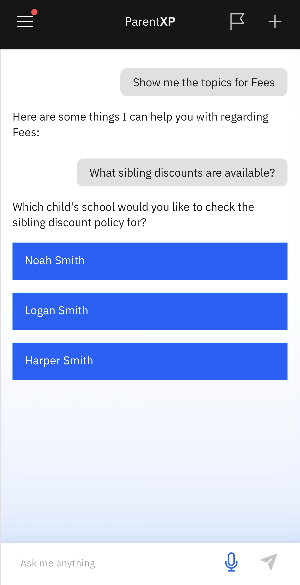

# Sibling Discount

When siblings are actively enrolled in the same school, you may be eligible for a discount.

1. Select Sibling Discount from the Nova prompts

   Click the **Fees** tile on the home screen. Select **Sibling Discount** from the suggested prompts.
   
2. Choose the relevant child to check for discount eligibility

   Select your child from the list to see which discounts are available. The information will automatically appear.

   
