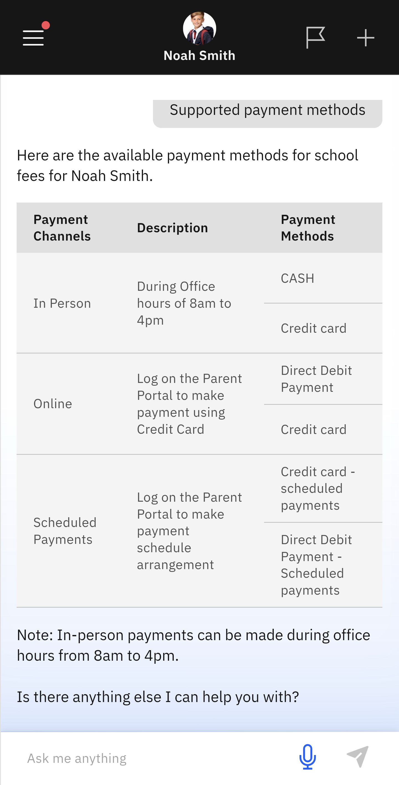

# Supported Payment Methods

The app provides information on the payment methods the school accepts.

1. Select the Fees tile

   Select the **Fees** tile on the home screen. Then select **Supported payment methods** from the tabs. The information will display automatically. The information includes a note on the school office hours for in-person payments.

