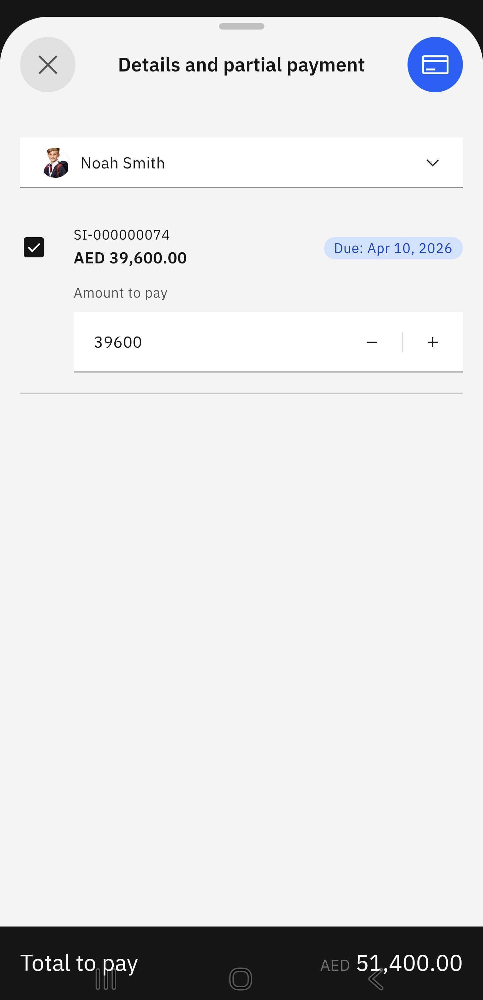

# View Outstanding Fees

1. Select View Outstanding Fees from the prompt

   Click the **Fees** tile on the home screen. Select **View Outstanding Fees** from the suggested prompts.

2. Select the child to view outstanding fees

   Choose your child from the dropdown menu. You can total up the fees for one or more children enrolled in the school. Select the fees in question. Click the credit card icon in the top-right corner of the screen.

   
   
3. View the fee breakdown

   The outstanding fees will automatically display in a table by child and amount due. You can pay the outstanding fees at this point. Below the table, you can either **Edit amounts** or **Proceed to payment**.

   
