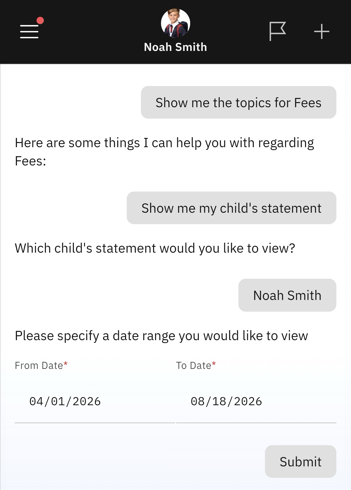

# View Statement of Account

This feature lets you view the account statement for each child enrolled in the school.

1. Select View Statement of Account

   Click the **Fees** tile from the home screen. Select the **View Statement of Account** prompt.

2. Select the child whose statement you want to see

   A list of every child enrolled in the school will appear. Select the child to view their statement. You will be asked to choose the statement's start and end dates.

   
