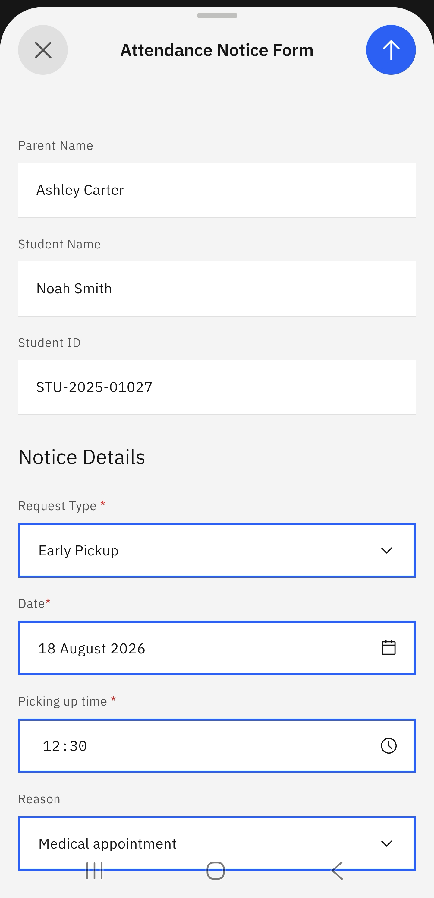

# Attendance Notice

If your child will arrive late to school or will be picked up early, you can submit an attendance notice through the app to inform staff and teachers. 

1. Click Attendance Notice 

   In the **Attendance** tile, click the **Attendance Notice** prompt. 

2. Select the relevant child and submit the notice form 

   If more than one child is enrolled in the school, select the relevant child.  Click **Submit late/early notice** and complete the form. Click the arrow in the top right to send the form.  

   > **Note:** The arrow to send the form only becomes active when all the fields are completed. 

   > **Note:** You will receive a confirmation message when you successfully submit the form. 

    
