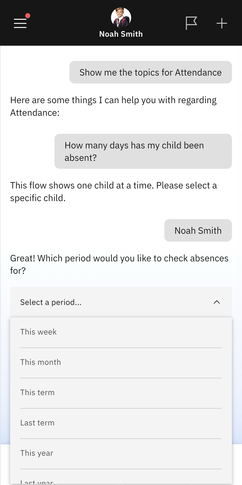

# Days Absent

Use this feature to view how many days of absence your child has. You can set the time frame to a week, term, or academic year, and include the previous academic year for comparison.

1. Select Days Absent from the list of prompts

   Select the **Attendance** tile from the home screen. Select the **Days Absent** prompt.

2. Identify the child whose records you wish to see

   The app will display a list of your children; select the child you want to view. Use the dropdown menu to choose the timeframe you want to view absences for.

   
