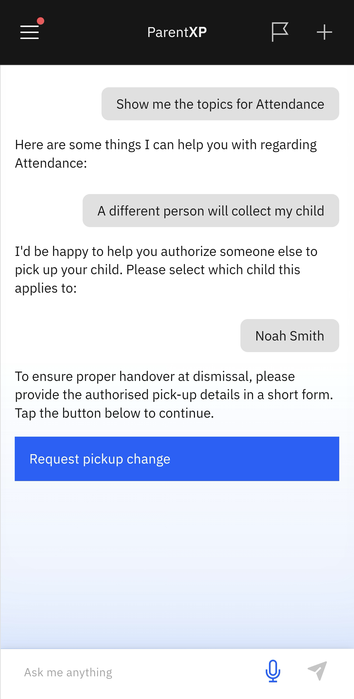

# Someone Else to Collect My Child

If someone other than the registered parents/guardian is picking up your child, use the Pick-up Change form to inform the school.

1. Select Someone Else to Collect My Child

   Click **Attendance** from the home screen tiles. Then select **Someone Else to Collect My Child** from the suggested prompts.

2. Select the child and complete the pickup change form

   If more than one child is enrolled at the school, a list will appear. Select the child in question. Click on and fill in the **Request pickup change** form. Send to the school by clicking on the arrow in the top-right corner.

   
