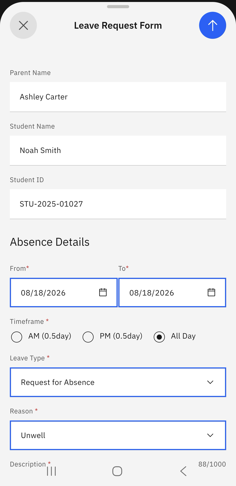

# Unexpected Absence

For unexpected absences, you can submit a form to notify the school. 

1. Select the Unexpected Absence prompt 

   Go to the **Attendance** tile on the home screen. Select the **Unexpected Absence** prompt.  

2. Select the child and complete the leave request form 

   Select the child that will be absent. Complete the **Open leave request form**. Optionally, upload any supporting documents for the required absence. Click the arrow in the top right to submit the form. 

   > **Note:** The arrow to send the form only becomes active when all the fields are completed. 

    
