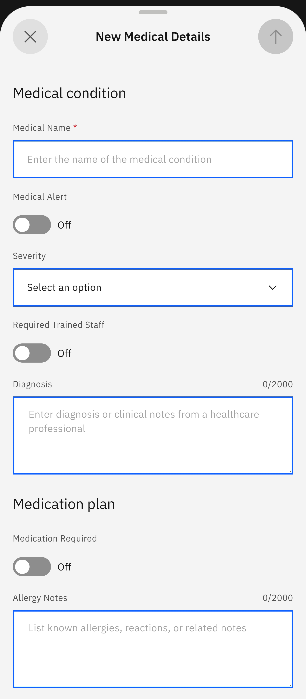
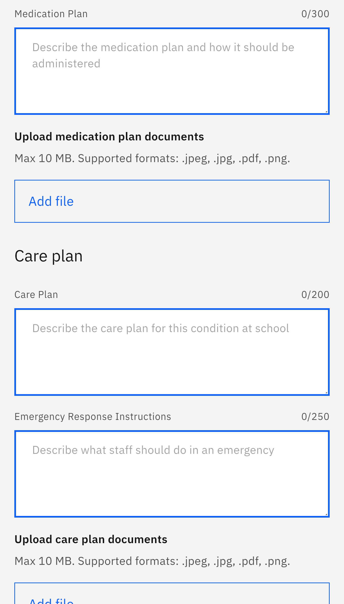

# Create Medical Information

In cases where you need to add new medical information to your child's profile, complete the New Medical Details form through this feature.

1. Use the prompts to create new medical information

   Click the **Student** tile from the home screen. Select **Create medical information** from the suggested prompts. The app will display all children enrolled in the school. Select the child whose profile you need to update.

2. Complete and share the New Medical Details form

   The **New Medical Details** form opens automatically. Fill in the fields and share it by pressing the arrow in the top right corner.

   > **Note:** The arrow will only activate when all the fields in the form are complete.

   
