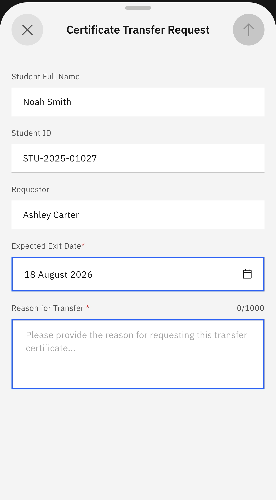
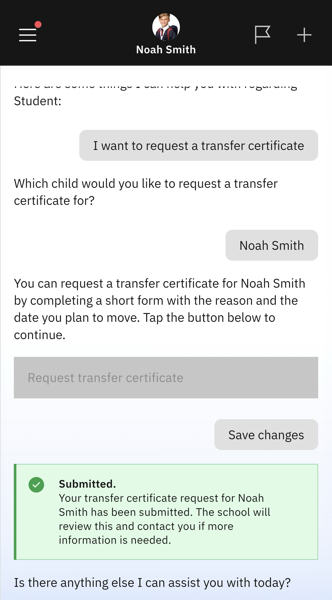

# Request Transfer Certificate

When your child moves to a new school or campus, they will need a transfer certificate and their curriculum records to present to the new school.

1. Select the prompt for a student transfer certificate

   Select the **Student** tile from the home screen. Select the **Request transfer certificate** prompt. A list of your children's names will appear; choose the child leaving the school.
   
2. Complete the transfer certificate request form

   The app will prompt you to complete a short form. Click **Request transfer certificate**. Complete the form and press the arrow in the top right of the screen. A success message appears after sending the form.

   

   
