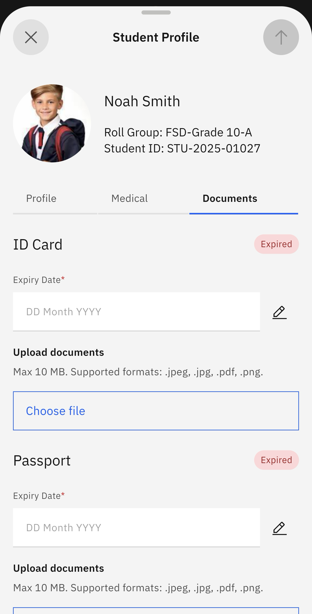

# Student Documents

Check or update your child's document details, such as a passport and ID.

1. Select Student Documents from the prompts

   Click on the **Student** tile on the home screen. Select **Student Documents** from the suggested prompts. A list of your children will appear. Select the child whose documents you want to see.

2. View or edit the document information

   The documents page will automatically load. You can view or edit the documents. To edit, click the pen icon in the top-right corner of the screen. Update the appropriate data. Optionally, you can upload an image of each document. To update the information, click the arrow, which activates when the fields are complete.

   
