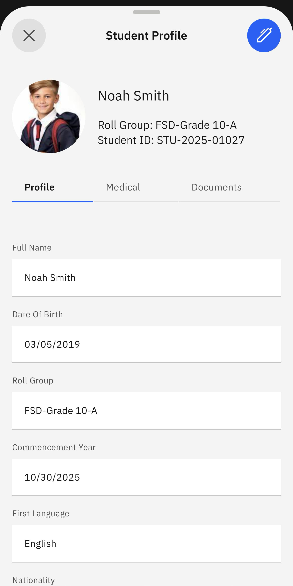

# View Student Profile

The student profile is the information shared with the school; it includes details like date of birth and nationality.

1. Select View Student Profile

   Click the **Student** tile from the home screen. Tap the **View Student Profile** prompt. Select your child's name from the list. Their profile will display automatically. Tap the pen icon at the top right of the screen to edit the profile details.

   
