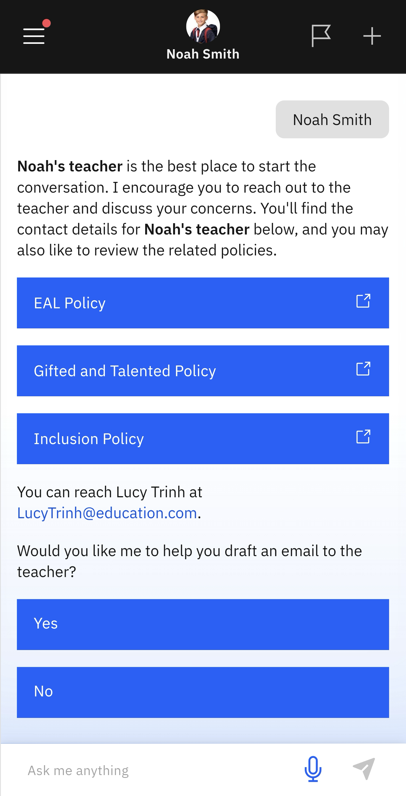

# Extra Support

Use this feature to review the learning support policies and to draft an email to your child's teacher.

1. Select Extra Support from the suggested prompts

   Click the **School Information** tile. Then select **Extra Support** from the suggested prompts. Choose your child from the list. The learning support policies will display automatically. The app will also help you draft an email to your child's teacher.

   > **Note:** The app will provide a list of topics to choose from when preparing the email to the teacher.
   
   
