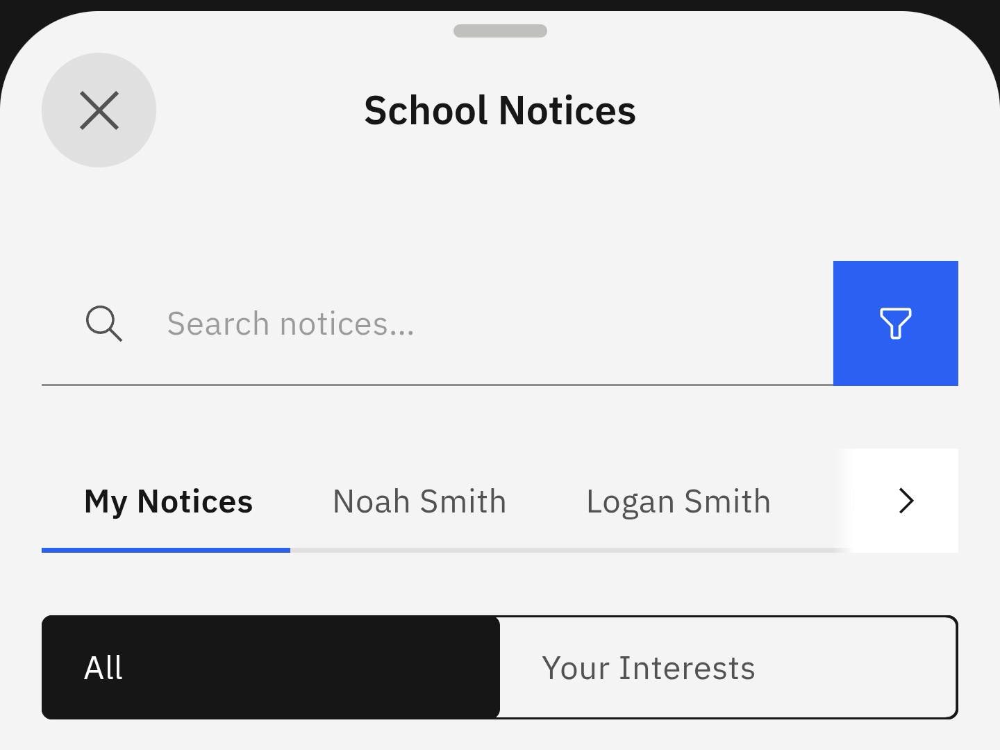

# View Notices

To follow up on notices related to you or your children, select the prompt and filter notices to match your needs and preferences.

> **Note:** You can also view your notices by clicking the bell icon in the navigation bar across the top of the home screen.

1. Select View notice from the suggested prompts

   Click the **School Information** tile. Select the **View notice** prompt. The screen will display the different options and settings for viewing your notices. Click the filter button to find a specific notice faster.

   
