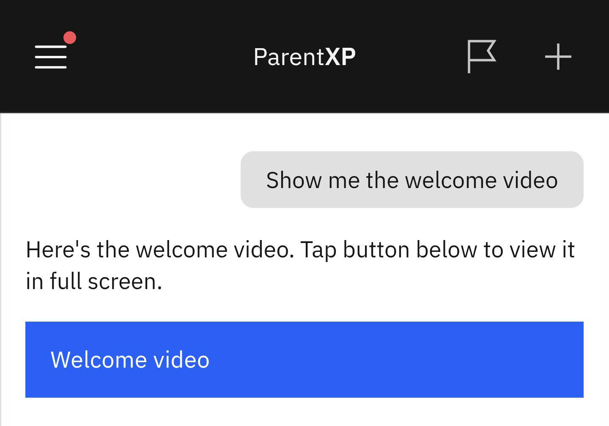

# Show Me the Welcome Video

The welcome video appears when you first log in to the Parent Experience Place (PXP) app. If you have clicked **Don't show video again**, you can search for it to rewatch it.

1. Type the prompt in Nova

   In the Nova input box at the base of any screen, type the prompt: **Show me the welcome video**. The video link will display automatically.

   
