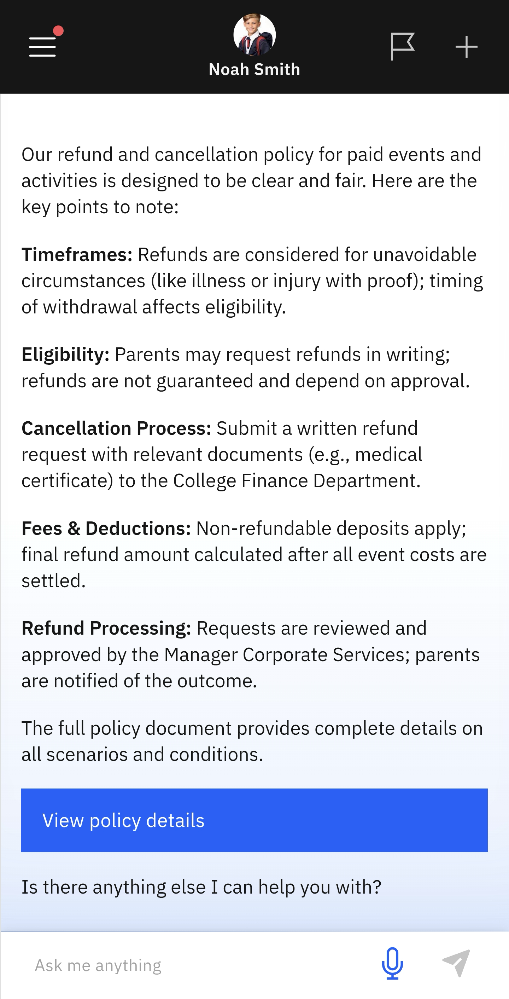

# Event Refund Policy

In the event that the activity is cancelled or your child is unable to attend an activity, you may be eligible for a refund. View the refund policy here.

1. Select Event Refund Policy from the suggested prompts

   Click **Events and Activities** from the home screen tiles. Select **Event Refund Policy** from the suggested prompts. Choose the child whose events you want to see.
   
2. View the policy details

   The key points of the refund policy will load automatically. For more details, you can click **View policy details**. This will give more details on the policy, and you can access the **Request for Refund form**.

   
