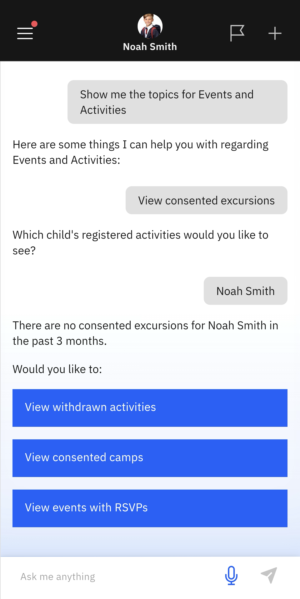

# View Consented Excursions

Use this page to search for upcoming excursions that you have already consented to your child attending.

1. Select View consented excursions from the suggested prompts

   Click **Events and Activities** from the home screen tiles. Select **View consented excursions** from the suggested prompts. Choose the child whose events you want to see. The app will notify you of any consented excursions (if any).

   > **Note:** The app will ask if you want to view withdrawn activities, consented camps or any events with RSVPs.

   
