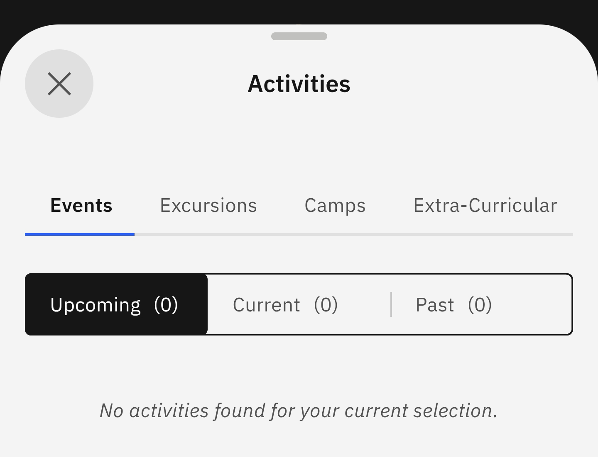

# View Event

Use this page to search for upcoming and current activities your child is enrolled in.

1. Select View Event from the suggested prompts

   Click **Events and Activities** from the home screen tiles. Select **View Event** from the suggested prompts. Choose the child whose events you want to see. The activities page will automatically load.

   
