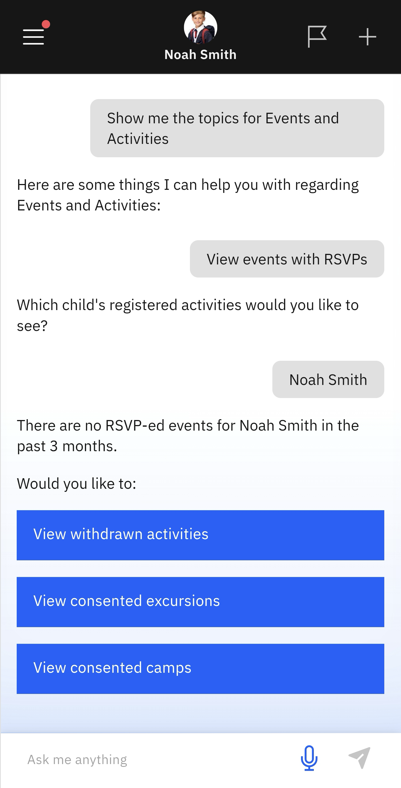

# View Events with RSVPs

Use this page to search for upcoming excursions or events that require an RSVP.

1. Select View events with RSVPs from the suggested prompts

   Click **Events and Activities** from the home screen tiles. Select **View events with RSVPs** from the suggested prompts. Choose the child whose events you want to see. The app will notify you of any events with RSVPs (if any).

   > **Note:** The app will ask if you want to view withdrawn activities or consented excursions or camps.

   
