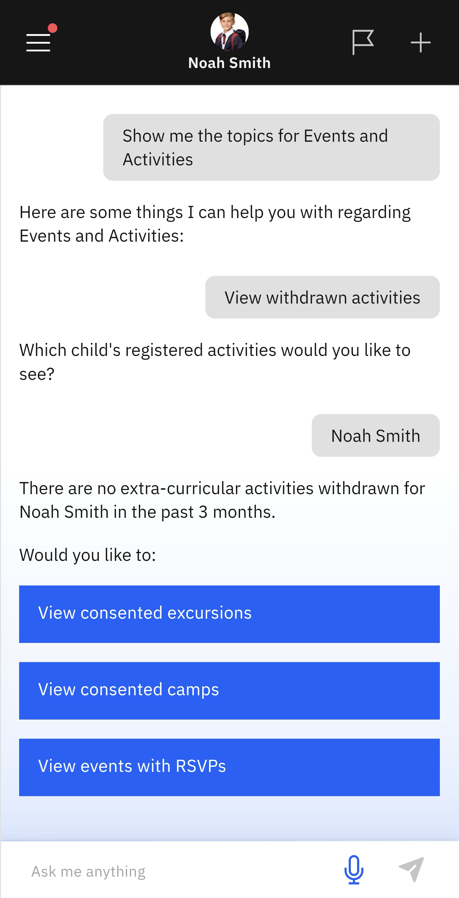

# View Withdrawn Activities

Use this page to search for activities or events that have been withdrawn or cancelled.

1. Select View withdrawn activities from the suggested prompts

   Click **Events and Activities** from the home screen tiles. Select **View withdrawn activities** from the suggested prompts. Choose the child whose events you want to see. The app will notify you of any activities that have been withdrawn (if any).

   > **Note:** The app will then ask whether you want to see consented excursions or camps, as well as any events with RSVPs.

   
