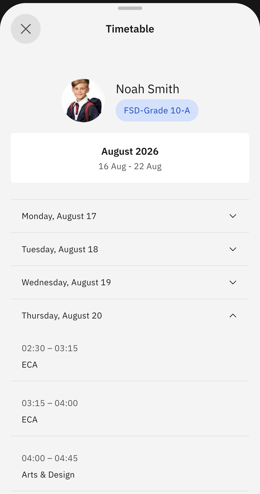

# View Class Timetable

Here, you can view your child's weekly timetable (Monday to Friday).

1. Select View Class Timetable from the suggested prompts

   Click on the **Timetable** tile. Then select **View Class Timetable**. Choose the child whose timetable you want to see. The timetable will automatically display. To view each day's timetable, expand the relevant day.

   
