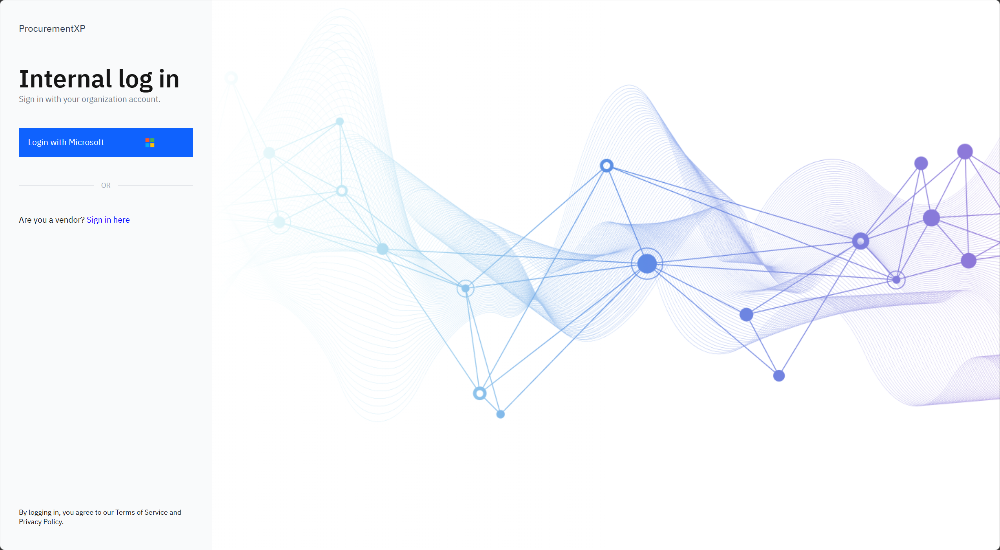

# Sign in to Procurement XP

Procurement XP uses your GEMS Microsoft 365 account — the same login you use for email.

1. Sign in with Microsoft

   Open Procurement XP and click **Sign in with Microsoft**.

   

2. Enter your details

   Enter your **GEMS M365** email and password, then click **Sign in**.

   > **Note:** The sign-in page also has a **Vendor sign in** button below, for external vendors accessing their own view.
