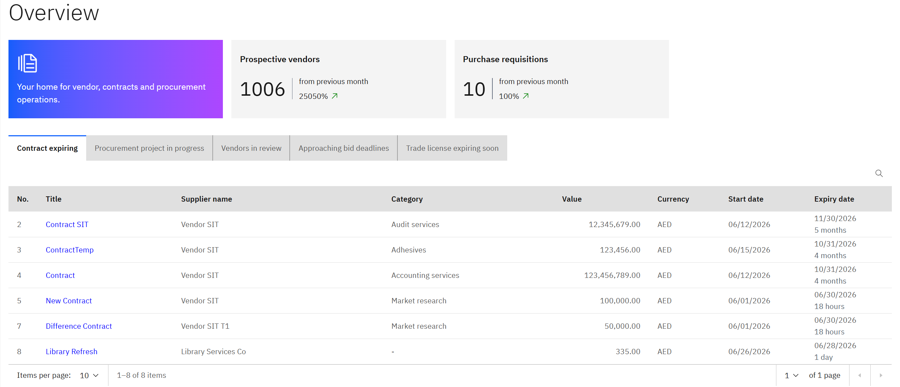

# Overview

The **Overview** is your Procurement XP landing page — a snapshot of everything happening across procurement. Return to it any time by clicking **Procurement XP** in the navigation bar.

1. What's on it

   A set of tabs cycles through key activity across the platform:

   - **Expiring contracts** — contracts approaching their end date that may need renewal or action.
   - **Procurement projects in progress** — active sourcing, bidding, and auction projects.
   - **Vendors in review** — prospective vendors currently working through the approval process.
   - **Approaching bid deadlines** — open RFQs and auctions with deadlines coming up soon.
   - **Trade licences expiring soon** — vendor trade licences that will need to be renewed.

   
