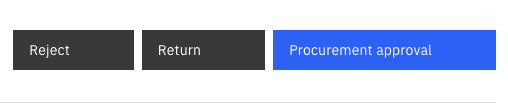

# Approve a Prospective Vendor - Procurement

After the vendor completes their details, a bot validation is performed. It takes 3-5 minutes for the form to be sent to procurement for review. If the finance team finds an issue with the form, it is sent back to procurement for further review and updates.

> **Note:** If there is an issue with bot validation, the status will change to manual intervention, requiring validation by the procurement team before approval can continue.

> **Note:** The documentation requirements differ depending on whether the prospective vendor is local or from overseas.

1. Validate the bot approval

   Sometimes, bot approval will require manual verification before the status updates to **Procurement review**. Complete the verification before proceeding with procurement approval.

2. Reject, return the form, or approve the prospective vendor

   Click the appropriate button, and leave a comment. If approved, click **Approve**. This will be sent to the finance team for review after approval.

   
