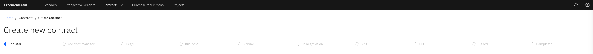

# Create a new contract - Initiator

Typically, the approval workflow starts with the contract **Initiator → Contract Manager → Legal → Business → Vendor**. There are four steps to initiate a contract: **Basic information, Contract Specifics, Attachment, Reviews and approvers**. As the creator of a new contract, you are the first step, the initiator.

1. Click New Contract

   A panel across the top of the page shows the current stage of the contract approval.

2. Fill in the required fields

   Click **Next** ti complete all parts of the form, or you can click **Save draft** to complete the form later.
   
3. Generate a contract document

   Select a **Contract Template Type** in the **Contracts Specifics** section, then click **Add another section +**. Then, at the bottom of the    page, click **Generate contract document**. This will automatically download the contract.

   
   
4. Attach Risk Assessment

   Upload **Risk Assessment** documents and identify the risk level in the **Risk Category**.
   
6. Select the Contract Manager

   In **Reviewers and approvers**, the person you select will receive the contract proposal to review in the next stage. Then click **Submit to    Contract Manager**.

   > **Note:** If any fields are missing, these will be highlighted in red, and the contract proposal cannot be submitted.
