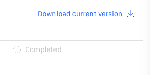
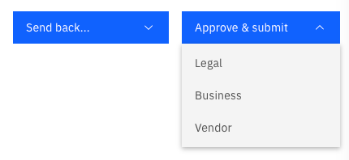

# Create a new contract - Contract manager

As the contract manager, you are assigned by the initiator after a contract is submitted. Here, you will review the contract and decide whether it should advance to the next approval stage.

1. Review the contract details

   If you notice any edits or issues, click **Send back…** to return the contract to the initiator for updating or modifying. Once finalised, download the current version by clicking **Download current version** on the right side of the screen.

   

3. Upload the updated Contract

   Attach the modified or updated contract in the **Attachment** tab under **Upload Contract**.
   
4. Identify and assign the next set of reviewers
   
   Select reviewers from **Legal**, **Business**, **CPO**, and **CEO** for contract approval.
   
5. Approve and Submit
   
   Assign the next reviewer for the contract. Choose from the **Legal** or **Business** team, or bypass both and submit the contract directly to the **Vendor**.

   
