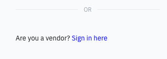

# Vendor Login and Contract Review

The vendor can access the contract through the sign-in page. They will receive the sign-in details from the school.

1. Sign in

   Below the main procurement sign-in square, the prompt says: **Are you a vendor? Sign in here**. Use the assigned login details to access the platform.

   
   
3. Review the contract

   The **Contracts** tab has tiles for active, in-progress, or completed contracts. Select the appropriate contract to download.
   
4. Upload and submit the counteroffer or modified contract

   Uploading the updated contract changes the progress status to **In negotiation**.

   > **Note:** You can access previous contract versions during negotiations by clicking **View version history**.

   
   
5. Approve the contract

   Once the vendor approves the contract, the remaining process is completed within the school.
