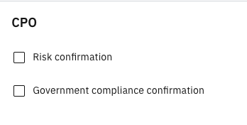

# Approving a contract - CPO

After the vendor approves the contract, the CPO is assigned for approval.

1. Review the latest version of the contract

   This version of the contract is approved by the **Vendor** and is ready for final checks.
   
3. Update and upload the contract

   Add necessary changes, then download the latest contract by clicking **Download current version**. Upload the updated version in the **Attachment** tab under **Upload Contract**.
   
4. Confirm risk and government compliance

   The CPO has an extra step to check **Risk Confirmation** and **Government compliance confirmation**.

   
   
5. Submit the contract to the CEO

   This forwards the contract to the CEO for approval.
