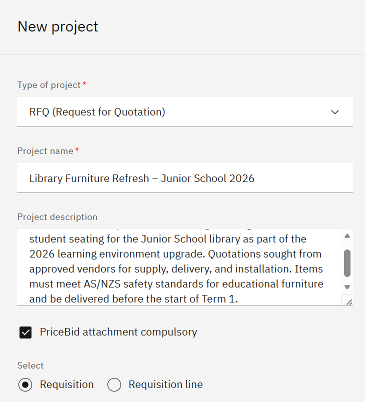
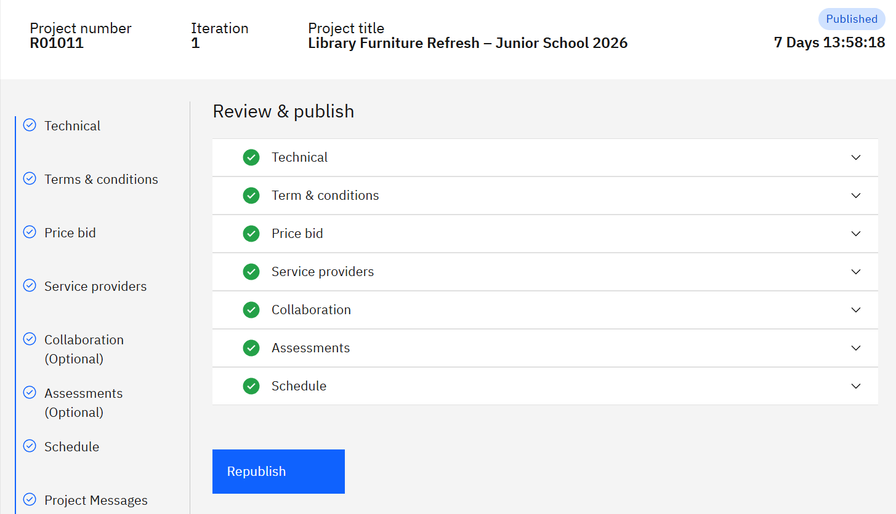

# Create a Sourcing Project

A sourcing project takes a purchase requisition raised in **D365 Finance & Operations** and runs it as an RFP or RFQ. You build out the project with technical specifications, terms, a price sheet and vendor assessments, then publish to invite vendors to bid.

1. Start a new project

   Open **Projects** and click **Create new project**. Enter a **Project description**, set the **Price visibility** option, then select the purchase requisition from the list — each requisition can hold multiple line items, which become the items vendors bid on. Click **Next**.

   

2. Build the project content

   Work through the content sections in order. In **Project introduction**, enter the introduction text — click **Copy from library** to reuse a saved version, or **Generate with AI** to draft one from a scope description. Add any **Additional requirements** the same way. In **Technical document**, enter the specifications vendors must meet. In **Terms and conditions**, click **Import from template** to reuse an approved set or **Create new** to write terms for this project. In **Price**, select the **Currency** and enter the number of items the project covers.

3. Set up the project

   Open **Service providers** and select the vendors to invite. Prospective vendors can be included — they receive the invitation email but must complete full onboarding before their bid can be accepted. Open **Collaborators**, add any users who will work on the project with you, and set the **Access level** for each. Open **Assessments**, select the **Company type**, then select the assessments required — the assessments that apply depend on company type, so a service company may need only a few or none.

4. Schedule, review the message, and publish

   Open **Scheduling** and set the submission close date — the last day vendors can submit. Open **Project messages** to review the invitation email that will be sent to vendors and add any additional information if needed. Click **Publish**, then **Confirm**.

   > **Note:** Publishing sends an invitation email to every selected vendor and prospective vendor. This cannot be undone.

   
