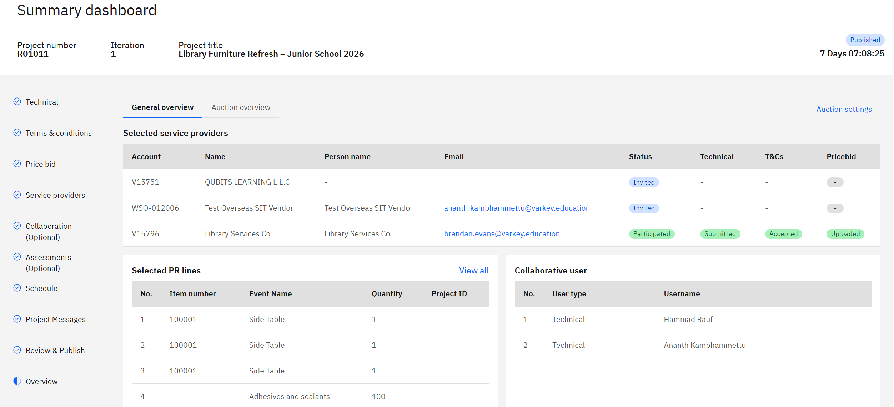
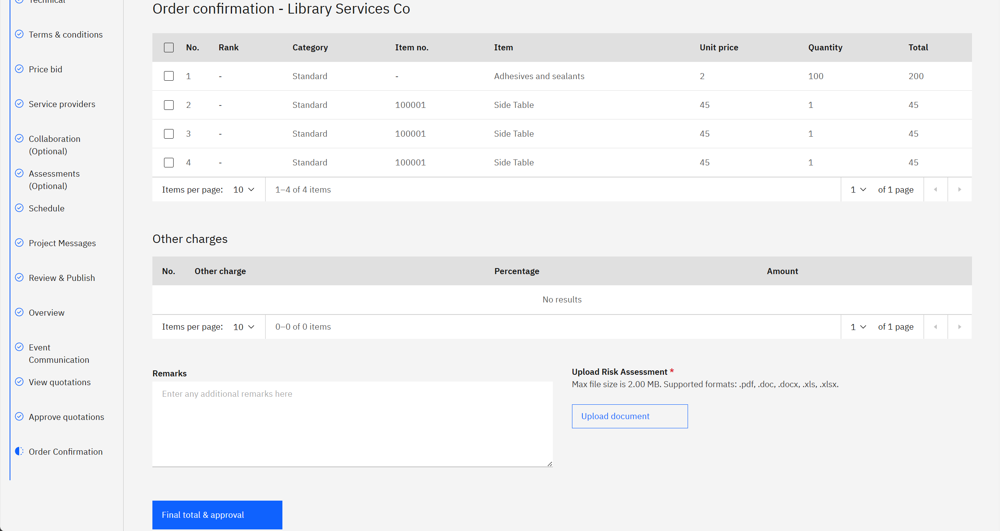
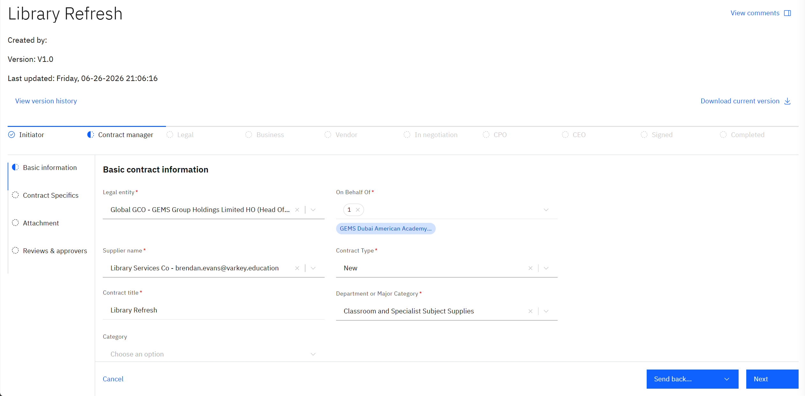

# Compare Quotations and Create a Contract

Once vendors have submitted their bids, you review all submissions side by side, award the project to the chosen vendor, and create the contract. Awarding closes the project, and the resulting contract is created in **D365 F&O**.

1. Review submitted bids

   In the **Projects** tab, open the sourcing project. Scroll down to the **Overview** step (on the left) to see every vendor the project was sent to and which have participated and submitted. Click **View quotations** to compare each vendor's submitted price and terms side by side.

   

2. Award the project

   On the **Approve Quotations** page, select the winning vendor, click **Award items to vendor +**, then click **Confirm**. Attach the risk assessment document if required, then approve the award. If there isn't a clear winner or further details are needed, you can click the **Next Round** button to open an auction.

   > **Note:** Awarding closes the project. The status changes to closed and awarded, and this cannot be undone.

   

3. Create the contract

   - Navigate to **Contracts**, click on **New Contract** search for the awarded vendor under **Supplier name** and find their **Approved bids** section.
   - Select the awarded project and fill in the remainder of the details.
   - Complete the remaining pages of the contract creation until you can review the contract summary — the project details carry over automatically, under **Review bid documents**, including the vendor's submitted attachments — then create the contract.
   - The contract is created in D365 F&O and appears in the procurement contract section.

   
