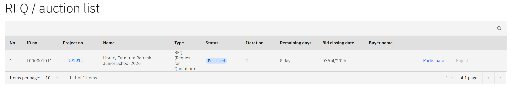
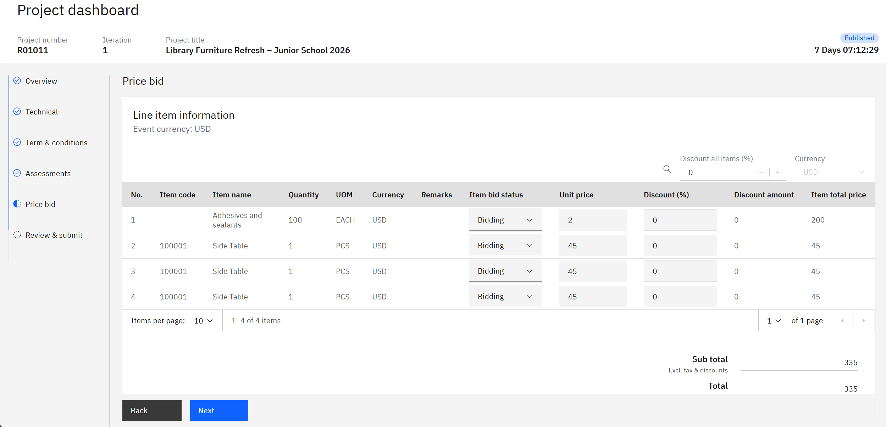

# Submit a Bid

This page is for vendors who have been invited to participate in a sourcing project. Internal staff can use it to walk a vendor through the process if they need support.

When a sourcing project is published, invited vendors receive an email containing a link to the vendor portal along with a username and password. Everything a vendor needs to submit their bid is contained within that email — no prior access to the system is required.

The bid has five parts to complete: documents, technical, terms and conditions, assessments, and price. All must be filled in before the bid can be submitted.

1. Log in and open the project

   Open the invitation email and log in to the vendor portal using the **Username** and **Password** provided in the email. Once logged in, click **RFQ** in the navigation — this is where all sourcing projects the vendor has been invited to are listed. Select the project and click **Participate** to begin.

   

2. Complete the bid

   The **Overview** page lists the documents the buyer has provided — review these and attach any supporting documents requested. Then work through each section:

   - **Technical** — review the technical specifications the buyer has sent and attach the vendor's technical documents in response.
   - **Terms and conditions** — read and accept the terms set by the buyer.
   - **Assessments** — answer the questionnaires. The questions shown depend on the company type the buyer selected for the project, so they may vary between projects.
   - **Price** — enter the **Unit price** for each item. Attach a supporting price document if one is required.

   

3. Submit the bid

   Once all sections are complete, click **Submit** to submit the bid.

   > **Note:** Once submitted, the bid is visible to the buyer immediately and cannot be recalled. Each invited vendor submits independently using their own credentials.
