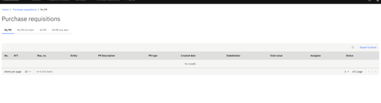

# Part 1 — Setup: Creating a PR and Sourcing Project

Before you can run a sourcing event, you need two things: a Purchase Requisition raised in Dynamics F&O, and a new project created in the sourcing portal. This section covers both.

1. **Create a Purchase Requisition in F&O**

   Log in to **Dynamics F&O** and go to **Procurement and Sourcing** ▸ **Purchase Requisitions** ▸ **All Purchase Requisitions**. Click **New** and fill in the requisition name and the relevant department or business unit. Add each product or service you are procuring as a separate line item, including a description, quantity, and estimated unit price. Once complete, save the PR and submit it for approval if your organisation's workflow requires it.

   > **Note:** *The PR does not need to be fully approved before you start building the sourcing project — but it must be saved and visible in the system so you can link it in the next step.*

2. **Create a New Sourcing Project**

   Log in to the sourcing portal and navigate to **Projects** from the top menu. Click **New Project**. Complete the following fields:

   | Field | What to enter |
   |---|---|
   | **Type of project** | Select **RFQ** or **RFP** depending on the procurement |
   | **Project name** | A clear name that identifies the procurement |
   | **Project description** | A short summary of the scope |
   | **PriceBid attachment compulsory** | Tick if vendors must attach a price document |
   | **Select** | Choose **Requisition** or **Requisition line** |

   If price weighting applies to this procurement, complete that field now.

   > **Note:** *Price weighting cannot be changed after vendors have been invited.*

3. **Link the Purchase Requisition**

   On the **Requisitions** screen within the new project, search for the PR you just created using its number or description. Select it and confirm. The line items from the PR will populate into the project automatically. Review them for accuracy — check descriptions, quantities, and units of measure — before moving on to Part 2.
