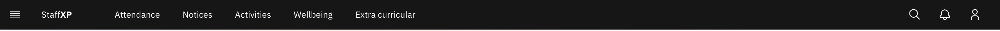

# Find your way around

The **navigation bar** sits across the top of every screen. Here's what's on it.

1. The main links

   **StaffXP** (far left) is your home, called the **MyDay** page; click it
   any time to return. Next to it are the section links: **Attendance**,
   **Notices**, **Activities**, **Wellbeing**, and **Extra curricular**.

   

2. The menu icon

   The icon at the far left opens **Training**, **Reporting**, and
   **Administration** links.

3. The far-right icons

   - **Search** — find pages or students.
   - **Notifications** (bell) — opens your **Messages** and **Alerts**.
   - **User menu** (person) — change your theme, open your profile, adjust
     settings, or sign out.
