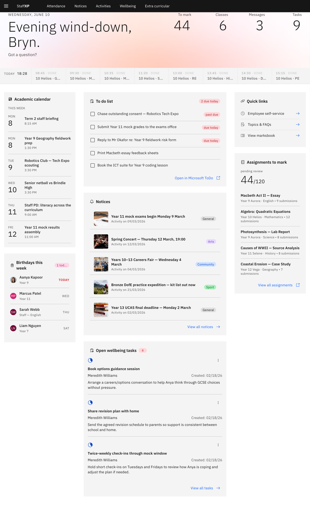

# Your MyDay home page

**MyDay** is the StaffXP landing page — your at-a-glance view of the day. Return to
it any time by clicking **StaffXP** in the navigation bar.

1. What's on it

   The tiles pull together what you need for the day: **Today's schedule** and
   timetable, **assignments to mark**, your **to-do list**, **notices**, this
   week's **birthdays**, and open **wellbeing tasks**.

   

2. Quick links

   The **Quick links** tile is the fast way into **Employee Self-Service**,
   **Topics & FAQs**, and **View markbook**.

   > **Note:** MyDay's look shifts through the day — morning, midday, and evening —
   > to match when you're using it.
