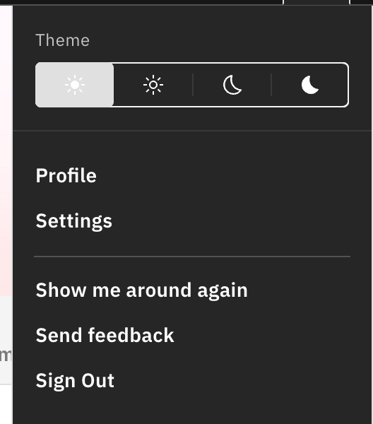

# Change the theme

Switch StaffXP between light and dark looks to suit your screen and lighting.

1. Open the theme picker

   Click the **User** icon (top right). The **Theme** row sits at the top of the menu.

2. Pick a theme

   Choose **Light**, **Subtle light**, **Subtle dark**, or **Dark** — it applies
   instantly across the platform.

   

   > **Note:** Light mode reads best in bright rooms, dark mode in dim ones — but
   > it's whatever's comfortable for you. You can also set this in **Settings**.
